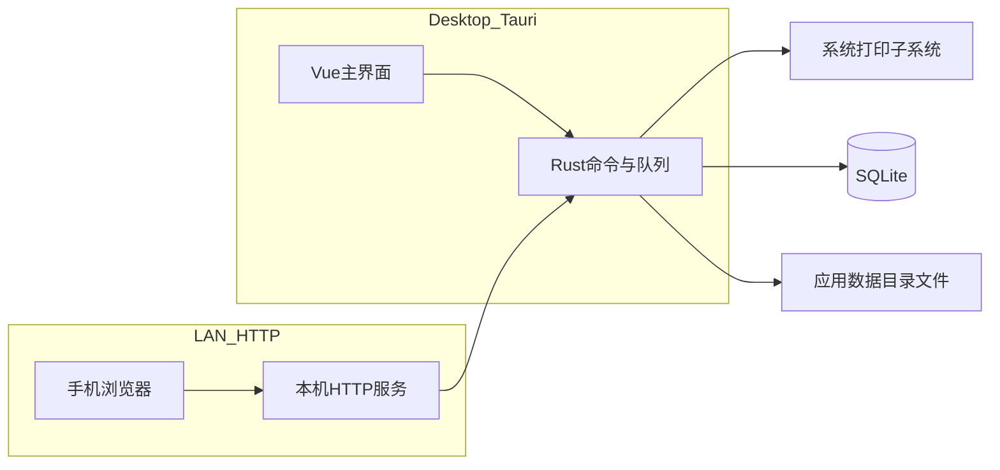

# 云打印客户端：截图需求分析与一期架构（含手机扫码）

## 1. 截图推导的需求清单

### 1.1 主界面（上传 + 状态 + 打印机）

| 能力域  | 需求要点                                                                          |
| ---- | ----------------------------------------------------------------------------- |
| 打印机  | 「刷新打印机」；列表展示名称、就绪/异常、是否默认、队列长度；可打开系统打印机管理（OS 能力）                              |
| 上传   | 大区域拖拽/点击选择；明确支持格式说明（截图含 PDF/Office/图片/CAD/设计类——**CAD/设计类在一期可标为“后续”或依赖外部转换器**） |
| 手机扫码 | 展示本机可访问 URL（如 `http://192.168.x.x:端口`）与二维码；「复制链接」                             |
| 统计   | 「队列任务」「今日完成」等汇总卡片（需持久化与按日聚合规则）                                                |

### 1.2 系统配置（文件格式 Tab）

- 按类分组：文档 / 表格 / 演示 / 图片；每项为扩展名多选开关。
- 「保存配置」：将允许扩展名写入持久化存储，并在上传入口（桌面与 HTTP）统一校验。
- 截图未展示但强相关的 Tab：**打印设置**（纸张、份数、双面、色彩、默认打印机覆盖等）、**系统设置**（监听地址/端口、日志级别、自动启动等）——一期至少预留路由与配置模型，可先实现「端口 + 绑定网卡/地址」与「默认打印机」。

### 1.3 系统日志

- 维度：级别、分类、关键词、行数；顶栏快捷分类（全部/服务/打印/上传/系统）与刷新。
- 展示：深色等宽区域；**结构化 JSON**（`timestamp`、`level`、`category`、`message`、`logger` 等）；可选「自动滚动」。
- 实现取向：后端统一写入日志表或内存环形缓冲 + 可选 WebSocket/SSE 推送；前端轮询为 MVP 降级方案。

---

## 2. 与现有代码的映射（避免重复造轮子）

当前仓库已具备可复用基础：

- [D:/APP_WQ/PRINT_APP/src-tauri/src/lib.rs](src-tauri/src/lib.rs)：已注册 `print_jobs_`*、`file_`*，并初始化 SQLite `AppState`。
- [D:/APP_WQ/PRINT_APP/src/App.vue](src/App.vue)：仍为例示 UI，但已验证 `invoke` 与 store/file/print_jobs 命令。

**建议**：将「打印任务」作为跨桌面上传与手机上传的**唯一业务实体**（状态机：`queued` → `printing` / `failed` / `done`），文件元数据与本地路径存库；HTTP 仅负责鉴权/上传并写入同一队列。

---

## 3. 一期架构（你已选：桌面 + 手机扫码）

- **本机 HTTP**：在 Tauri 进程内用 Rust（如 `axum` + `tokio`）绑定 `0.0.0.0:可配置端口`；提供最小路由：`GET /`（或轻量上传页）、`POST /upload`、可选 `GET /api/health`。
- **安全（一期必做底线）**：局域网暴露面大，至少包含：**上传大小限制**、**扩展名校验（与配置一致）**、**简单 token 或一次性会话密钥**（配置页展示/二维码带 query），避免任意内网设备匿名打爆磁盘与打印队列。
- **二维码内容**：`http://{本机LAN_IP}:{port}/...?token=...`；「复制链接」同串。LAN IP 获取在 Windows 上可用网络接口枚举（需处理多网卡/VPN）。

---

## 4. 打印与格式转换（风险最高的子系统）

- **Windows 打印**：枚举打印机、默认打印机、提交作业——优先使用 **Win32 Print API**（`windows` crate 等），与截图「打开打印机管理」一致走系统能力。
- **可直接打印**：PDF、常见位图（PNG/JPEG 等）——可走「写入假脱机 / ShellExecute 打印」或 GDI/打印 API 路径（具体选型在实现阶段定一种稳定方案）。
- **Office/OpenXML/HTML 等**：截图列表很长；**一期务实策略**建议写进规格：
  - **路径 A（推荐起步）**：允许上传，但若未安装 **LibreOffice（无界面）** 或等价转换器，则任务标记 `needs_conversion` 并提示用户安装；已安装则 headless 转 PDF 再打印。
  - **路径 B（延后）**：CAD/专有格式单独插件或外部服务——不在一期承诺「真打印」，仅做扩展名灰显或拒绝并记录日志。

---

## 5. 推荐分阶段交付（在「桌面+手机」前提下仍可控）

1. **阶段 A — 桌面闭环**：打印机枚举/刷新、文件选择与校验、任务入队、日志写入、配置（扩展名 + 端口 + token）持久化；本机打印 PDF/图片 PoC。
2. **阶段 B — 局域网 HTTP + 二维码**：上传 API、与桌面共用队列；防火墙/绑定地址提示；复制链接。
3. **阶段 C — 转换链**：接入 LibreOffice（或你指定的转换栈），覆盖截图中 Office/ODF/HTML 等主力格式；失败时结构化日志 + UI 提示。
4. **阶段 D — 运维与体验**：日志实时推送、统计「今日完成」、打印设置 Tab、与截图一致的 Ant Design 布局（若 UI 选型为 antd，可配合 [.cursor/skills/antd/SKILL.md](.cursor/skills/antd/SKILL.md)）。

---

## 6. 非功能需求（从截图与场景反推）

- **可观测性**：JSON 日志 schema 固定，便于过滤与后续对接外部日志系统。
- **可靠性**：上传写临时文件 → 校验 → 再原子更新任务记录；崩溃恢复策略（未完成任务重试或标记失败）。
- **隐私**：默认仅监听局域网；文档不落云（除非后续你明确要做远端队列）。

---

## 7. 文档与流程说明（brainstorming 对齐）

你当前处于 **Plan 模式**：本计划可作为「需求 + 架构」草案。按 brainstorming 规范，后续若进入正式规格，可将定稿写入 `docs/superpowers/specs/` 并由你确认后再用 **writing-plans** 拆任务；本次不在仓库内自动创建该文件（除非你退出 plan 模式并要求写入）。

---

## 8. 关键风险与依赖

- **Windows 防火墙**：首次监听端口可能弹窗或需用户放行——产品文案与首次向导要考虑。
- **多网卡 IP 选择**：二维码 URL 可能选错网段——配置中允许「首选网卡」或手动填展示用 Host。
- **Office/CAD**：法律与体积（LibreOffice 安装）及转换耗时——必须在 UI/日志中可感知，避免「静默失败」。

