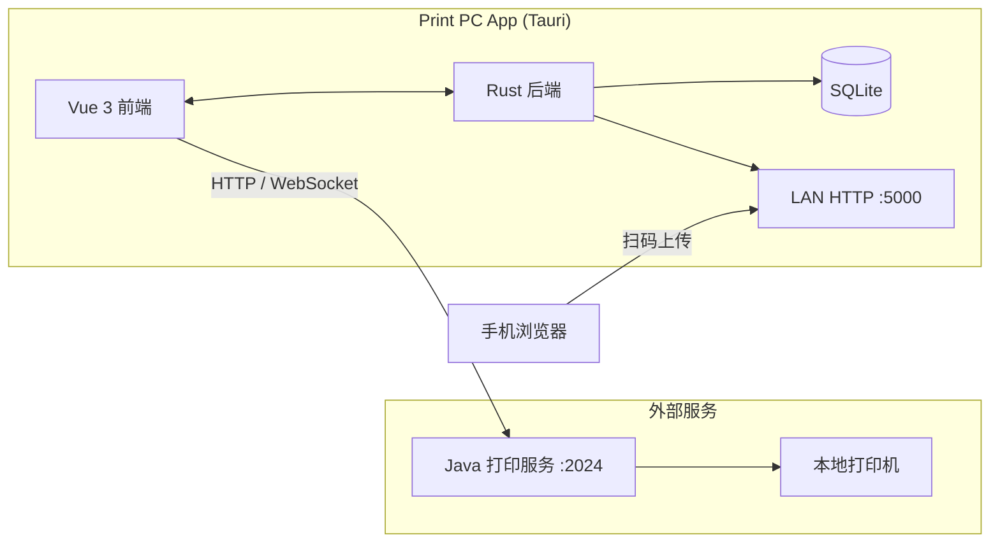

<div align="center">

# 网络打印服务 · Print PC App

**局域网文件上传 · 云打印编排 · 桌面端一站式打印客户端**

基于 **Tauri 2** 的跨平台桌面应用，连接本地 **Java 打印服务**，让办公室里的打印机也能被手机与电脑轻松共享。

<br/>

[](https://tauri.app/)
[](https://vuejs.org/)
[](https://www.rust-lang.org/)
[](./LICENSE)

[功能亮点](#features) · [快速开始](#quick-start) · [架构说明](#architecture) · [配置说明](#config)

</div>

---

<a id="features"></a>

## ✨ 功能亮点

| 模块 | 说明 |
|------|------|
| 📁 **文件管理** | 拖拽 / 点击上传，支持 PDF、图片、纯文本、HTML；列表排序、预览、批量选择与删除 |
| 🖨️ **打印任务** | 对接 Java 打印服务，WebSocket 实时状态，打印参数可配置 |
| 📱 **手机传文件** | 内置局域网 HTTP 服务 + 二维码，手机扫码即可上传（Token 鉴权、扩展名白名单、50MB 限制） |
| 🔍 **服务发现** | 启动时自动扫描局域网，定位 Java 打印服务地址 |
| 📜 **打印历史** | SQLite 持久化记录，支持筛选与 CSV 导出 |
| 📋 **系统日志** | 前后端统一写入，便于运维排错 |
| 🎨 **现代界面** | Ant Design Vue 4 + 自定义无边框标题栏；桌面侧栏 / 移动底栏自适应 |
| 🔔 **托盘驻留** | 关闭窗口最小化到系统托盘，打印服务持续在线 |

---

## 🖼️ 界面预览

> 截图可后续补充到 `docs/screenshots/`，在 README 中引用即可。

```
┌──────────────────────────────────────────────────────────┐
│  网络打印服务                              ─  □  ×       │
├──────────┬───────────────────────────────────────────────┤
│ 文件管理 │  [ 拖拽文件到此处或点击上传 ]                    │
│ 打印任务 │  ┌─────────────────────────────────────────┐   │
│ 打印历史 │  │  document.pdf          预览 · 打印 · 删除 │   │
│ 系统日志 │  └─────────────────────────────────────────┘   │
│ 系统配置 │  ┌─────────────┐  局域网扫码上传 · 服务状态    │
│          │  │  QR Code    │  打印机列表 · 连接状态        │
└──────────┴───────────────────────────────────────────────┘
```

---

<a id="architecture"></a>

## 🏗 架构说明



| 层级 | 技术 |
|------|------|
| 桌面壳 | Tauri 2 |
| 前端 | Vue 3 · TypeScript · Pinia · Vue Router · Ant Design Vue |
| 后端 | Rust · rusqlite · axum（局域网上传） |
| 打印执行 | 外部 Java Spring Boot 服务（默认 `http://localhost:2024`） |

---

<a id="quick-start"></a>

## 🚀 快速开始

### 环境要求

- [Node.js](https://nodejs.org/) 18+
- [pnpm](https://pnpm.io/)（项目强制使用 pnpm）
- [Rust](https://www.rust-lang.org/tools/install) **≥ 1.88.0**（`rustup update stable`）
- Windows 构建需安装 [WebView2](https://developer.microsoft.com/microsoft-edge/webview2/)

### 安装与开发

```bash
git clone git@github.com:w-q666/print-pcapp.git
cd print-pcapp
pnpm install
pnpm tauri dev
```

### 常用命令

| 命令 | 说明 |
|------|------|
| `pnpm dev` | 仅启动前端开发服务（`:1420`） |
| `pnpm build` | 构建前端到 `dist/` |
| `pnpm tauri dev` | 前端 + Rust 联调 |
| `pnpm tauri build` | 生产打包（安装包在 `src-tauri/target/release/bundle/`） |
| `cd src-tauri && cargo test` | Rust 单元测试 |

---

<a id="config"></a>

## ⚙️ 配置说明

### Java 打印服务

本客户端**不负责驱动打印机**，需单独部署 Java 打印服务（默认端口 **2024**）：

- HTTP：`getPrintServers`、`print/single`
- WebSocket：`/print`（打印状态推送）

在应用 **系统配置** 中可修改服务 IP、端口，并配置局域网扫描范围；首次启动会自动尝试发现局域网内的打印服务。

### 局域网手机上传

- 默认端口：**5000**（可在设置中调整）
- 上传页与 `POST /upload` 由 Rust 内置 axum 服务提供
- 二维码 URL 含鉴权 Token，仅允许白名单扩展名

### Windows 拖放说明

`tauri.conf.json` 中 `dragDropEnabled: false` 用于在 Windows 上启用 HTML5 文件拖放（antd `UploadDragger`）。与 Tauri 原生窗口拖放互斥，详见 [Tauri 文档](https://v2.tauri.app/reference/config/#windowconfig)。

---

## 📂 项目结构

```
print-pcapp/
├── src/                    # Vue 3 前端
│   ├── views/              # 页面：文件 / 打印队列 / 历史 / 日志 / 设置
│   ├── stores/             # Pinia 状态
│   ├── composables/        # 文件、打印、WebSocket 等组合式逻辑
│   └── api/                # Java 服务 HTTP / WS 客户端
├── src-tauri/              # Rust 后端
│   ├── src/lib.rs          # 应用入口、插件、LAN 服务、托盘
│   ├── commands.rs         # Tauri IPC 命令
│   ├── http_server.rs      # 局域网上传服务
│   └── db.rs               # SQLite 迁移与初始化
└── docs/                   # 设计与实现文档
```

---

## 🛠 技术栈

**前端** — Vue 3 · TypeScript · Vite · Ant Design Vue · pdfjs-dist  

**后端** — Rust · Tauri 2 · rusqlite · axum · tokio  

**持久化** — SQLite（任务与日志）· Tauri Store（应用设置）

---

## 📦 发布构建

```bash
pnpm tauri build
```

Windows 产物示例：

- `src-tauri/target/release/bundle/msi/*.msi`
- `src-tauri/target/release/bundle/nsis/*-setup.exe`

---

## 🤝 参与贡献

欢迎提交 Issue 与 Pull Request。开发前建议阅读仓库内的 `CLAUDE.md` / `AGENTS.md` 了解架构约定。

1. Fork 本仓库  
2. 创建特性分支：`git checkout -b feat/your-feature`  
3. 提交改动并发起 PR  

---

## 📄 开源协议

本项目基于 [MIT License](./LICENSE) 开源。

---

<div align="center">

**如果这个项目对你有帮助，欢迎点个 Star ⭐**

Made with ❤️ by [@w-q666](https://github.com/w-q666)

</div>
